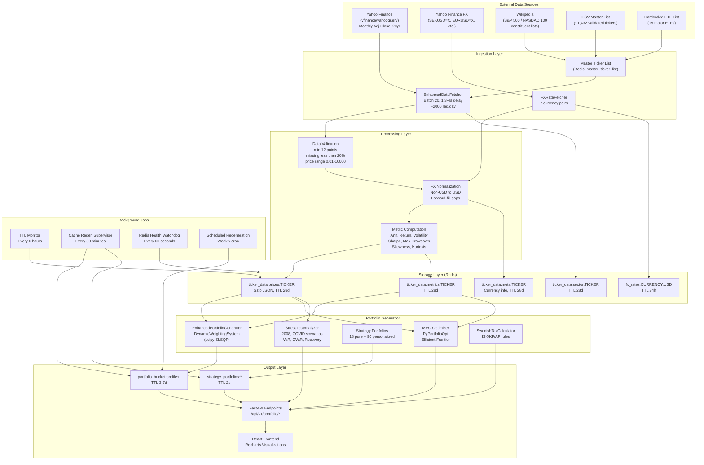

# Data Documentation Audit and Recommendations

## Part 1: Current State of Data Documentation

### 1.1 External Data Sources Identified in Code

The project relies on five external/static data sources, **none of which are documented in a single centralized location**:


| Source                                       | Library                             | Location in Code                                                                                                                         | Documented?                    |
| -------------------------------------------- | ----------------------------------- | ---------------------------------------------------------------------------------------------------------------------------------------- | ------------------------------ |
| Yahoo Finance (prices, sector, company info) | yfinance 0.2.66, yahooquery >=2.4.1 | [backend/utils/enhanced_data_fetcher.py](backend/utils/enhanced_data_fetcher.py)                                                         | Partial (code docstrings only) |
| Yahoo Finance FX (currency conversion)       | yahooquery                          | [backend/utils/fx_fetcher.py](backend/utils/fx_fetcher.py)                                                                               | Not documented                 |
| Wikipedia (S&P 500, NASDAQ 100 lists)        | pandas `read_html`                  | [backend/utils/enhanced_data_fetcher.py](backend/utils/enhanced_data_fetcher.py)                                                         | Not documented                 |
| CSV Master List (~1,432 tickers)             | pandas                              | [backend/scripts/reports/fetchable_master_list_validated_latest.csv](backend/scripts/reports/fetchable_master_list_validated_latest.csv) | Mentioned in deployment docs   |
| Hardcoded ETF List (15 ETFs)                 | static list                         | [backend/utils/enhanced_data_fetcher.py](backend/utils/enhanced_data_fetcher.py)                                                         | Not documented                 |


### 1.2 Data Processing -- What Happens and Where


| Stage                | Module(s)                                                       | What It Does                                                                     | Documented?                                                                      |
| -------------------- | --------------------------------------------------------------- | -------------------------------------------------------------------------------- | -------------------------------------------------------------------------------- |
| Ingestion            | `enhanced_data_fetcher.py`                                      | Fetches 20yr monthly adj close from Yahoo, rate-limited (batch 20, 1.3-4s delay) | Partial (code comments)                                                          |
| Validation           | `enhanced_data_fetcher.py`                                      | Min 12 data points, missing < 20%, price range 0.01-10000, no all-zero           | Not documented                                                                   |
| FX Conversion        | `fx_fetcher.py`                                                 | Non-USD prices converted to USD using historical FX; forward-fill gaps           | Not documented                                                                   |
| Metric Computation   | `port_analytics.py`, `batch_compute_all_metrics.py`             | Annualized return, volatility, Sharpe, max drawdown, skewness, kurtosis          | Not documented                                                                   |
| Storage              | `redis_first_data_service.py`, `redis_config.py`                | Gzip-compressed JSON in Redis with TTL jitter                                    | Partially documented in [docs/REDIS_ARCHITECTURE.md](docs/REDIS_ARCHITECTURE.md) |
| Portfolio Generation | `enhanced_portfolio_generator.py`, `portfolio_mvo_optimizer.py` | MVO via PyPortfolioOpt, dynamic weighting via scipy SLSQP                        | Not documented                                                                   |
| Stress Testing       | `stress_test_analyzer.py`                                       | Historical scenario analysis (2008, COVID), VaR, CVaR, recovery                  | Not documented                                                                   |
| Tax Calculation      | `swedish_tax_calculator.py`, `avanza_courtage_calculator.py`    | ISK/KF/AF Swedish tax rules, Avanza courtage tiers                               | Partially (inline constants)                                                     |


### 1.3 Data Frequency and Temporal Resolution


| Data Type           | Granularity                 | Refresh Rate                        | TTL                      | Documented?                       |
| ------------------- | --------------------------- | ----------------------------------- | ------------------------ | --------------------------------- |
| Ticker prices       | Monthly (adj close)         | On cache miss                       | 28 days (+/- 15% jitter) | Partially (REDIS_ARCHITECTURE.md) |
| Ticker metrics      | Derived from monthly prices | Computed at fetch time              | 28 days                  | Not documented                    |
| FX rates            | Daily                       | On access                           | 24 hours                 | Not documented                    |
| Master ticker list  | Static/periodic             | Manual or fallback                  | 24h / 1 year (validated) | Partially                         |
| Portfolio buckets   | Generated                   | Background regen every 30 min check | 3-7 days                 | Partially                         |
| Strategy portfolios | Generated                   | Pre-generated + regen               | 2 days                   | Not documented                    |


### 1.4 Financial Methodology -- Undocumented Inconsistencies

Critical finding: the project uses **two different annualization methods** depending on the module:

- `port_analytics.py`: compound -- `(1 + monthly_return)^12 - 1`
- `batch_compute_all_metrics.py`, `calculate_portfolio_ticker_metrics.py`: simple -- `mean_return * 12`

Other undocumented assumptions:

- Risk-free rate hardcoded at 3.8% in some places, 0% in others
- Diversification score has **four different implementations** across modules
- Data quality threshold is 180 months (~15 years) but not explained
- Min overlap for optimization is 12 months (configurable but undocumented)

### 1.5 Documentation Coverage Map

**Global (project-level) docs that touch data:**

- [README.md](README.md) -- Tech stack, architecture overview, API list. **No data source section.**
- [docs/REDIS_ARCHITECTURE.md](docs/REDIS_ARCHITECTURE.md) -- Good coverage of Redis storage layer, key patterns, TTLs
- [docs/DEPLOYMENT_OPERATIONS.md](docs/DEPLOYMENT_OPERATIONS.md) -- Master list -> Redis flow, population modes
- [docs/BACKEND_UTILS_REFERENCE.md](docs/BACKEND_UTILS_REFERENCE.md) -- Lists 31 utilities with descriptions
- [TICKER_UPDATE_WORKFLOW.md](TICKER_UPDATE_WORKFLOW.md) -- Ticker refresh procedure
- [.claude/project overview.md](.claude/project%20overview.md) -- High-level architecture

**Local (in-module) documentation:**

- `enhanced_data_fetcher.py` -- Partial docstrings on fetch methods
- `fx_fetcher.py` -- Partial docstrings on FX conversion
- `swedish_tax_calculator.py` -- Inline constants with source year
- Most other data pipeline modules have minimal or no docstrings

**Frontend data attribution:**

- Only in `StockSelection.tsx` (~line 2768): "Data Source: Yahoo Finance (monthly returns, annualized)"
- No attribution on stress tests, optimization, projections, sector analysis, or exported reports

---

## Part 2: Identified Gaps

### Critical Gaps (must fix for transparency/reproducibility)

1. **No centralized data source document** -- sources are discoverable only by reading code
2. **No financial methodology documentation** -- annualization formulas, Sharpe ratio parameters, diversification scoring, optimization approach
3. **No data validation rules documentation** -- thresholds live only in code
4. **Inconsistent annualization methods** across modules (compound vs simple) -- not documented, possibly a bug
5. **Inconsistent risk-free rate** (3.8% vs 0%) across modules -- not documented
6. **Multiple divergent diversification score implementations** -- 4 variants, no documentation of which is used where

### Important Gaps (should fix for academic/professional quality)

1. **No FX conversion methodology documentation** -- currency pairs, forward-fill strategy, conversion timing
2. **No data freshness guarantees** documented -- what happens when Yahoo is unavailable?
3. **No UI methodology page** -- users cannot learn how results are computed
4. **Minimal data attribution in UI** -- only one component credits Yahoo Finance
5. **No data dictionary** for Redis key structures and their contents

### Minor Gaps (nice to have)

1. **No rate limiting documentation** for Yahoo Finance API usage
2. **No data lineage tracking** -- cannot trace a displayed number back to its source
3. **No changelog for data processing logic** changes

---

## Part 3: Recommendations

### Recommendation 1: Create `docs/DATA_SOURCES_AND_METHODOLOGY.md`

This is the **single most impactful improvement**. One document as the source of truth covering:

- Section 1: External Data Sources (provider, library, data type, auth, rate limits)
- Section 2: Ticker Universe (S&P 500, NASDAQ 100, ETFs, validation criteria)
- Section 3: Data Processing Pipeline (ingestion, validation rules, FX conversion, metric computation)
- Section 4: Financial Methodology (annualization formula, Sharpe ratio, diversification score, MVO approach, stress test methodology)
- Section 5: Data Freshness (TTLs, regeneration schedule, staleness behavior)
- Section 6: Assumptions and Limitations (risk-free rate, historical data caveats, FX approximation)
- Section 7: Data Attribution Policy (how sources are credited in the UI)

**Location**: `docs/DATA_SOURCES_AND_METHODOLOGY.md`
**Detail level**: Full -- formulas, thresholds, provider names, library versions

### Recommendation 2: Add "Data Sources" Section to README.md

A brief 1-paragraph section in the main README linking to the full document:

```markdown
## Data Sources
This project uses publicly available market data from Yahoo Finance (via yfinance and yahooquery),
including monthly adjusted close prices for ~1,432 validated tickers across S&P 500, NASDAQ 100,
and 15 major ETFs. See [docs/DATA_SOURCES_AND_METHODOLOGY.md](docs/DATA_SOURCES_AND_METHODOLOGY.md)
for full details on data sources, processing methodology, and assumptions.
```

### Recommendation 3: Add Module-Level Docstrings to 5 Key Backend Files

Each should have a module docstring covering: data source, key parameters, methodology, link to full doc.

Files: `enhanced_data_fetcher.py`, `fx_fetcher.py`, `port_analytics.py`, `portfolio_mvo_optimizer.py`, `stress_test_analyzer.py`

### Recommendation 4: Resolve Methodology Inconsistencies

Before documenting, fix these code inconsistencies:

- Standardize annualization method (compound vs simple) across all modules
- Standardize risk-free rate (3.8% or 0%) or document why they differ
- Consolidate or clearly differentiate the 4 diversification score implementations

### Recommendation 5: Add Data Attribution to Frontend UI

Add consistent "Source: Yahoo Finance" labels to:

- Portfolio recommendations, optimization results, stress test results, five-year projections
- Consider a footer "Methodology" link for the full explanation

### Recommendation 6: Create a Data Dictionary

A table in `docs/DATA_DICTIONARY.md` mapping every Redis key pattern to:

- Data type, source, TTL, compression, schema/fields, example value

---

## Part 4: Proposed Data Workflow Architecture




---

## Part 5: Implementation Plan

### Step 1: Create `docs/DATA_SOURCES_AND_METHODOLOGY.md`

The comprehensive data provenance document with 7 sections as described in Recommendation 1. This should include:

- All 5 data sources with provider details, library versions, rate limits
- Complete data processing pipeline description
- All financial formulas (annualized return, volatility, Sharpe, drawdown, diversification)
- Validation thresholds and rules
- FX conversion methodology
- TTL schedule and freshness guarantees
- All assumptions and limitations
- The data workflow diagram (mermaid)

### Step 2: Create `docs/DATA_DICTIONARY.md`

A structured reference mapping every Redis key pattern to its schema, source, TTL, and purpose.

### Step 3: Add "Data Sources" section to README.md

A brief paragraph with link to the full methodology document.

### Step 4: Add module-level docstrings to 5 key backend files

`enhanced_data_fetcher.py`, `fx_fetcher.py`, `port_analytics.py`, `portfolio_mvo_optimizer.py`, `stress_test_analyzer.py`

### Step 5: Document and resolve methodology inconsistencies

Audit and standardize: annualization method, risk-free rate, diversification score implementations. Document the chosen approach.

### Step 6: Improve frontend data attribution

Add "Source: Yahoo Finance" to portfolio recommendations, optimization, stress tests, projections, and exported reports.