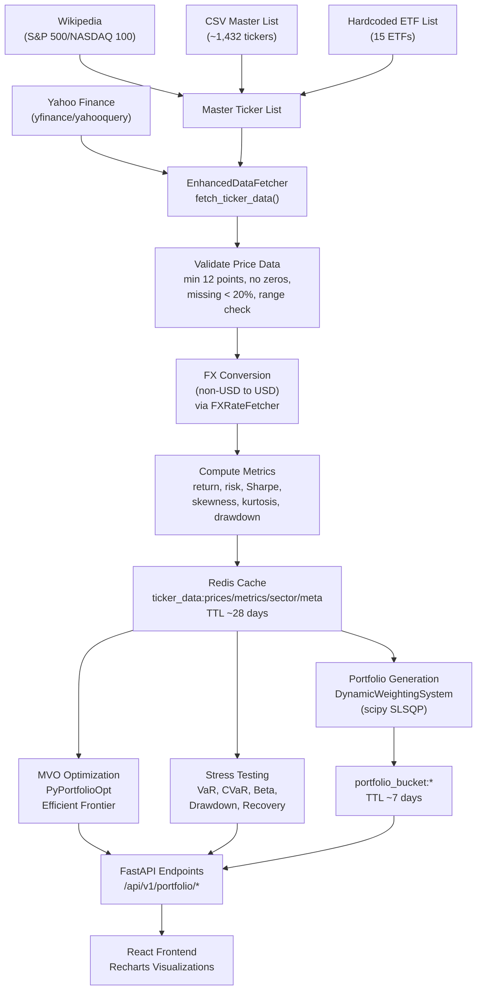

# Data Provenance Documentation Review and Plan

## Current Findings

### A. Data Origins Identified

The system relies on five external/static data sources:


| Source | Library/Method | Data Provided | Auth Required |
| ------ | -------------- | ------------- | ------------- |


1. **Yahoo Finance** (yfinance 0.2.66, yahooquery 2.4) -- Primary source for 20-year monthly adjusted close prices, sector/industry classification, company name, country, exchange. No API key required; rate-limited to ~2000 requests/day. Called in `[backend/utils/enhanced_data_fetcher.py](backend/utils/enhanced_data_fetcher.py)` via `_fetch_ticker_yahooquery()` and `_fetch_ticker_yahooquery_range()`.
2. **Yahoo Finance FX** (yahooquery) -- Historical FX rates for EUR, GBP, SEK, CHF, NOK, DKK, PLN vs USD. Called in `[backend/utils/fx_fetcher.py](backend/utils/fx_fetcher.py)` via `FXRateFetcher`. Tickers like `SEKUSD=X`.
3. **Wikipedia** (pandas `read_html`) -- S&P 500 and NASDAQ 100 ticker lists scraped from Wikipedia tables. Used as fallback when the master list is empty. Called in `[backend/utils/enhanced_data_fetcher.py](backend/utils/enhanced_data_fetcher.py)` via `_fetch_sp500_tickers()` and `_fetch_nasdaq100_tickers()`.
4. **CSV Master List** -- `[backend/scripts/reports/fetchable_master_list_validated_latest.csv](backend/scripts/reports/fetchable_master_list_validated_latest.csv)` containing ~1,432 validated tickers. Loaded when Redis `master_ticker_list_validated` is empty.
5. **Hardcoded ETF List** -- 15 major ETFs (SPY, IVV, VOO, QQQ, etc.) defined statically in `_fetch_top_etfs()` within `[backend/utils/enhanced_data_fetcher.py](backend/utils/enhanced_data_fetcher.py)`.

### B. Data Processing Pipeline

The pipeline flows through these stages:




### C. Data Frequency and Granularity


| Data Type | Update Frequency | TTL | Mechanism |
| --------- | ---------------- | --- | --------- |


- **Ticker price data**: Fetched on cache miss; TTL ~28 days (configurable via `CACHE_TTL_DAYS`). Monthly granularity (20 years of monthly adjusted close).
- **Ticker metrics**: Computed at fetch time; same TTL as prices.
- **FX rates**: 24-hour TTL; refreshed daily on access.
- **Master ticker list**: 24-hour TTL in Redis.
- **Portfolio buckets**: ~7-day TTL; regenerated via `scheduled_regen.py` (cron/systemd every 7 days) or background TTL monitor (checks every 30 minutes via `CACHE_REGEN_LOOP_SECONDS`).
- **Strategy portfolios**: Pre-generated at startup; TTL varies.
- **Background monitoring**: TTL watchdog checks every 30 min; Redis health ping periodic; Prometheus metrics every 30 sec.

### D. Current Documentation Coverage

**Partially documented:**

- `[docs/REDIS_ARCHITECTURE.md](docs/REDIS_ARCHITECTURE.md)` -- Redis key patterns, TTLs, data flow (good coverage of storage layer)
- `[docs/BACKEND_UTILS_REFERENCE.md](docs/BACKEND_UTILS_REFERENCE.md)` -- Lists 31 utility modules with descriptions
- `[docs/DEPLOYMENT_OPERATIONS.md](docs/DEPLOYMENT_OPERATIONS.md)` -- Data population procedures
- `[TICKER_UPDATE_WORKFLOW.md](TICKER_UPDATE_WORKFLOW.md)` -- How tickers are refreshed
- `[.claude/project overview.md](.claude/project overview.md)` -- High-level architecture
- `[README.md](README.md)` -- Quick start, deployment, tech stack

**NOT documented anywhere:**

- No single document listing all external data sources and their providers
- No documentation of the data validation rules (min 12 points, missing < 20%, price range 0.01-10000)
- No documentation of the FX conversion methodology
- No documentation of financial calculation methodologies (annualization formulas, Sharpe with rf=0, monthly-to-annual scaling)
- No documentation of data freshness guarantees or staleness risks
- No methodology page in the frontend UI
- Data source attribution in UI is minimal -- only the Two-Asset Analysis tab in `StockSelection` shows "Data Source: Yahoo Finance"
- No documentation of rate limiting strategy for Yahoo Finance (batch size 20, 1.3-4s delay, 2000/day limit)
- No documentation of what happens when Yahoo Finance is unavailable (fallback behavior)

---

## Recommendations

### 1. Create a Dedicated Data Provenance Document

Create `[docs/DATA_SOURCES_AND_METHODOLOGY.md](docs/DATA_SOURCES_AND_METHODOLOGY.md)` as the single source of truth. This is the most impactful addition -- a global document rather than scattered per-file docs. Rationale: data provenance is cross-cutting; it spans fetching, processing, storage, and display.

### 2. Add Methodology Section to Frontend

Add a "Methodology" or "About Our Data" accessible section (footer link or info panel) that briefly explains:

- Data comes from Yahoo Finance (free, publicly available market data)
- Monthly historical prices, up to 20 years
- Portfolio optimization uses Modern Portfolio Theory
- Risk profiles based on behavioral finance research
- Data refreshed approximately monthly
- Disclaimer about educational/informational purpose

### 3. Improve In-UI Data Attribution

Currently only Two-Asset Analysis shows "Data Source: Yahoo Finance." Add consistent attribution to:

- Portfolio recommendations
- Stress test results
- Optimization results
- Five-year projections

### 4. Add Inline Documentation to Key Backend Files

Add docstrings/module-level comments in the five critical data pipeline files:

- `[backend/utils/enhanced_data_fetcher.py](backend/utils/enhanced_data_fetcher.py)` -- data source, validation rules, rate limiting
- `[backend/utils/fx_fetcher.py](backend/utils/fx_fetcher.py)` -- FX methodology, currency pairs
- `[backend/utils/port_analytics.py](backend/utils/port_analytics.py)` -- financial formulas, assumptions
- `[backend/utils/portfolio_mvo_optimizer.py](backend/utils/portfolio_mvo_optimizer.py)` -- MVO methodology
- `[backend/utils/stress_test_analyzer.py](backend/utils/stress_test_analyzer.py)` -- stress test methodology

---

## Proposed Documentation Structure

### `docs/DATA_SOURCES_AND_METHODOLOGY.md`

```markdown
# Data Sources and Methodology

## 1. External Data Sources

### 1.1 Market Price Data
- Provider: Yahoo Finance (via yfinance and yahooquery libraries)
- Data: Monthly adjusted close prices
- History: Up to 20 years
- Universe: ~1,432 validated tickers (S&P 500, NASDAQ 100, 15 major ETFs)
- Authentication: None (public API)
- Rate limits: ~2,000 requests/day, batch size 20, 1.3-4s delay between requests

### 1.2 Fundamental Data
- Provider: Yahoo Finance
- Data: Sector, industry, country, exchange, company name

### 1.3 Foreign Exchange Rates
- Provider: Yahoo Finance (via yahooquery)
- Pairs: EUR/USD, GBP/USD, SEK/USD, CHF/USD, NOK/USD, DKK/USD, PLN/USD
- Purpose: Convert non-USD-denominated prices to USD for consistent analysis

### 1.4 Ticker Universe
- Primary: Validated master list (CSV, ~1,432 tickers)
- Fallback: Wikipedia scrape of S&P 500 and NASDAQ 100
- Static: 15 hardcoded major ETFs (SPY, IVV, VOO, QQQ, ...)

## 2. Data Processing Pipeline

### 2.1 Ingestion
(describe fetch flow, validation, FX conversion)

### 2.2 Validation Rules
(min 12 data points, missing < 20%, price range, non-zero variance)

### 2.3 Metric Computation
(annualized return, risk, Sharpe, max drawdown, skewness, kurtosis)

### 2.4 Storage
(Redis key patterns, TTLs, gzip compression)

## 3. Data Freshness and Update Schedule
(TTLs, regeneration schedule, background monitoring)

## 4. Financial Methodology

### 4.1 Portfolio Optimization
(MVO via PyPortfolioOpt, dynamic weighting via scipy SLSQP)

### 4.2 Risk Metrics
(VaR 95%, CVaR, Beta, Sortino, maximum drawdown)

### 4.3 Stress Testing
(historical scenarios, recovery analysis)

### 4.4 Tax Calculations
(ISK, KF, AF -- Swedish tax rules for 2025/2026)

## 5. Assumptions and Limitations
- Risk-free rate assumed 0% for Sharpe ratio
- Monthly returns annualized via (1+r)^12-1
- Yahoo Finance data may have gaps or inaccuracies
- FX conversion uses daily spot rates, not transaction rates
- Historical performance does not predict future results

## 6. Data Attribution
(how sources are credited in the UI)
```

### Best Locations Summary

- **Global documentation**: `docs/DATA_SOURCES_AND_METHODOLOGY.md` (new, single source of truth)
- **Redis specifics**: Keep in existing `docs/REDIS_ARCHITECTURE.md` with cross-reference
- **Backend inline**: Module-level docstrings in the 5 key utility files
- **Frontend UI**: Methodology footer link + consistent "Source: Yahoo Finance" labels
- **README.md**: Add a brief "Data Sources" section linking to the full document

### Appropriate Level of Detail

- `**docs/DATA_SOURCES_AND_METHODOLOGY.md`**: Full detail -- this is the reference document for transparency and reproducibility. Include provider names, library versions, validation thresholds, formulas, TTLs, and assumptions.
- **Backend docstrings**: Medium detail -- summarize the data source, key parameters, and link to the full doc.
- **Frontend UI**: Light detail -- provider name, data type, disclaimer. Link to full methodology if needed.
- **README.md**: One paragraph + link to full document.

