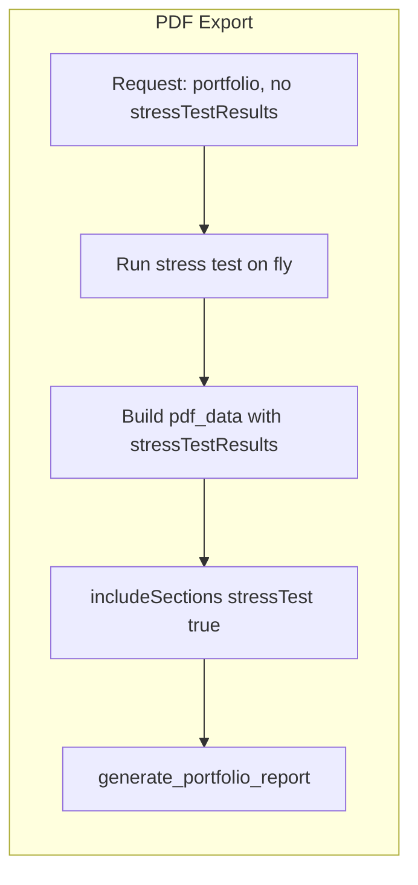

# Always Include Stress Test Graph in PDF and Other Exports

## Current behavior

- **PDF:** The Stress Test Analysis section and "Peak-to-Trough Drawdown by Scenario" chart are only added when `data.get('stressTestResults')` is truthy and `include_sections.get('stressTest', True)` is true ([pdf_report_generator.py](backend/utils/pdf_report_generator.py) ~1565–1692). The frontend sends `stressTestResults` only when the user ran the stress step, and sets `includeSections.stressTest` to `state.stressTestResults != null` ([FinalizePortfolio.tsx](frontend/src/components/wizard/FinalizePortfolio.tsx) ~775–777, 787). So if the user skips the stress step, no stress data is sent and the section/chart are omitted.
- **CSV/ZIP:** The stress file is generated only when `"stressTest" in body.includeFiles` and `stress_test_results` is truthy ([portfolio.py](backend/routers/portfolio.py) ~~10861). The frontend always sends `"stressTest"` in `includeFiles` (~~879), but `stress_test_results` is null when the user did not run the step, so no stress CSV is produced.

## Goal

Always include the stress test section and the Peak-to-Trough Drawdown graph in PDF (and stress data in CSV/ZIP) whenever the export request contains a valid portfolio (e.g. at least two holdings), regardless of whether the user completed the stress testing step.

## Approach

Run the stress test on the backend during export when `stressTestResults` is missing or empty: use the same COVID-19 and 2008 crisis scenarios and the same response shape as the existing `/stress-test` endpoint, then pass that into the PDF generator and CSV builder. No change to Redis or frontend behavior is required; the "always include" behavior is backend-only.

## Implementation

### 1. Shared helper to run stress test for export

- **Where:** [backend/routers/portfolio.py](backend/routers/portfolio.py) (near other export helpers like `_normalize_export_portfolio`, before the export routes ~line 10500).
- **Import:** Move `from utils.stress_test_analyzer import StressTestAnalyzer` to top-level imports (currently duplicated inside both PDF and CSV export blocks).
- **What:** Add an internal helper, e.g. `_run_stress_test_for_export(portfolio_list: List[Dict]) -> Optional[Dict]`, that:
  - Takes the already-normalized `portfolio_list` (from `_normalize_export_portfolio`; allocations in `allocation` or `weight`, 0–1 scale).
  - Extracts tickers and weights; normalizes weights to sum to 1 if needed; requires at least 2 tickers and positive total weight.
  - Instantiates `StressTestAnalyzer`, runs `analyze_covid19_scenario(tickers, weights)` and `analyze_2008_crisis_scenario(tickers, weights)`.
  - Builds `scenario_results = {'covid19': result1, '2008_crisis': result2}`.
  - Computes `resilience_score` and `overall_assessment` using the same logic as the existing `/stress-test` handler (lines ~4223–4276: drawdown score, recovery score, volatility score, then weighted average and assessment text). **Recommended:** Extract a small function `_calculate_resilience_score(scenario_results) -> Tuple[float, str]` that can be reused by both the `/stress-test` endpoint and this helper.
  - Returns `{'scenarios': scenario_results, 'resilience_score': round(resilience_score, 1), 'overall_assessment': assessment, 'portfolio_summary': {...}}` or `None` if the portfolio is invalid or both scenario calls fail.
- **Error handling:** Log and catch exceptions per scenario; if at least one scenario succeeds, still return a result (partial scenarios are acceptable for the drawdown chart). Return `None` only when the portfolio is invalid or no scenario succeeds.
- **Code deduplication:** This helper replaces the duplicate scenario-fetching logic currently in both PDF export (lines 10634-10667) and CSV export (lines 10773-10803).

### 2. PDF export: run stress test when results missing

- **Where:** [backend/routers/portfolio.py](backend/routers/portfolio.py), in `export_pdf` (around 10620–10690).
- **Logic:**
  - After `portfolio_list = _enrich_export_portfolio_sectors(portfolio_list)` and before the existing "Ensure both stress test scenarios" block, add:
    - If `body.stressTestResults` is None or has no/empty `scenarios`, and `portfolio_list` has at least 2 holdings, call `_run_stress_test_for_export(portfolio_list)`. If the result is not None, set `stress_test_results = <result>`.
  - Keep the existing enrichment block that fills in missing COVID-19/2008 when the user already has some stress results (so we still complete partial results).
  - When building `pdf_data`, set `includeSections` to a copy of `body.includeSections` and, if `stress_test_results` is not None, set `includeSections['stressTest'] = True` so the PDF generator always renders the section when we have stress data (including on-the-fly data). Pass this `includeSections` into `pdf_data`.
- **Result:** Requests with no stress step still get a full Stress Test Analysis section and the Peak-to-Trough Drawdown chart.

### 3. CSV/ZIP export: run stress test when results missing

- **Where:** [backend/routers/portfolio.py](backend/routers/portfolio.py), in the CSV export handler (around 10760–10865).
- **Logic:**
  - After normalizing and enriching `portfolio_list`, if `body.stressTestResults` is None or has no/empty `scenarios`, and `portfolio_list` has at least 2 holdings, call `_run_stress_test_for_export(portfolio_list)`. If the result is not None, set `stress_test_results = <result>`.
  - Keep the existing logic that enriches missing COVID-19/2008 when the user already sent some stress results.
  - No change to the condition for adding the stress CSV: `if "stressTest" in body.includeFiles and stress_test_results` already works; once `stress_test_results` is populated on the fly, the stress file will be included.

### 4. Frontend

- No code changes required. The frontend can continue to send `stressTest: state.stressTestResults != null` and `stressTestResults: state.stressTestResults`; the backend will fill in stress data when missing and force the section into the PDF.

### 5. Testing

- **PDF without stress step (primary):** Add a test (e.g. in a new or existing test file under `backend/`, or in `backend/scripts/`) that:
  - POSTs to the PDF export endpoint with a valid minimal body: portfolio with at least 2 holdings (tickers + allocations), no `stressTestResults` (or null), and `includeSections` with `stressTest: false`.
  - Asserts response status 200 and `Content-Type: application/pdf`.
  - Asserts that the response body (PDF bytes) contains the bytes for the string "Peak-to-Trough Drawdown" or "Stress Test Analysis" (or both) to ensure the section and chart are present.
- **CSV without stress step:** Same idea for the CSV export endpoint: send a valid portfolio, no `stressTestResults`, `includeFiles` including `"stressTest"`. Assert 200 and that the returned ZIP (or list of files) includes a file like `stress_test_results.csv` with non-empty content and expected columns/scenario names.
- **Regression (with stress step):** Call PDF export with the same portfolio but with pre-filled `stressTestResults` (e.g. from a prior stress-test response) and `includeSections.stressTest: true`. Assert 200 and that the PDF still contains the stress section (and optionally that the drawdown values match the provided data, if feasible).
- **Edge:** Portfolio with 0 or 1 holding: export should still succeed (200) but no stress section in PDF and no stress CSV, or stress section omitted when helper returns None.

Run the tests (e.g. `pytest` for the new tests) and manually verify one PDF export without running the stress step in the UI to confirm the graph appears.

## Files to touch

- [backend/routers/portfolio.py](backend/routers/portfolio.py): add `_run_stress_test_for_export`, update PDF export and CSV export to call it when stress results are missing and portfolio is valid; in PDF path set `includeSections['stressTest'] = True` when stress data is present.
- New or existing backend test module: add tests for PDF and CSV export without `stressTestResults` and regression test with `stressTestResults`.

## Summary

| Export  | When stress results missing   | Action                                                                                                 |
| ------- | ----------------------------- | ------------------------------------------------------------------------------------------------------ |
| PDF     | Valid portfolio (2+ holdings) | Run COVID-19 + 2008 via helper, set `stressTestResults` and `includeSections.stressTest = True`        |
| CSV/ZIP | Same                          | Run same helper, set `stress_test_results`; existing condition then includes `stress_test_results.csv` |

The drawdown chart and stress section will always appear in PDF (and stress data in CSV) whenever the exported portfolio is valid, regardless of whether the user completed the stress testing step in the wizard.

## Considerations

- **Performance:** Running stress test on-the-fly adds ~2-5 seconds to export (fetches historical prices from Redis/Yahoo). Acceptable for export operations which are already async.
- **Graceful degradation:** If stress test fails (e.g., missing price data for a ticker), the export should still succeed—just without the stress section.
- **No frontend changes:** Backend handles everything; existing frontend logic continues to work.
- **Idempotent:** If user already ran stress test, their data is used; helper only runs when `stressTestResults` is None or empty.