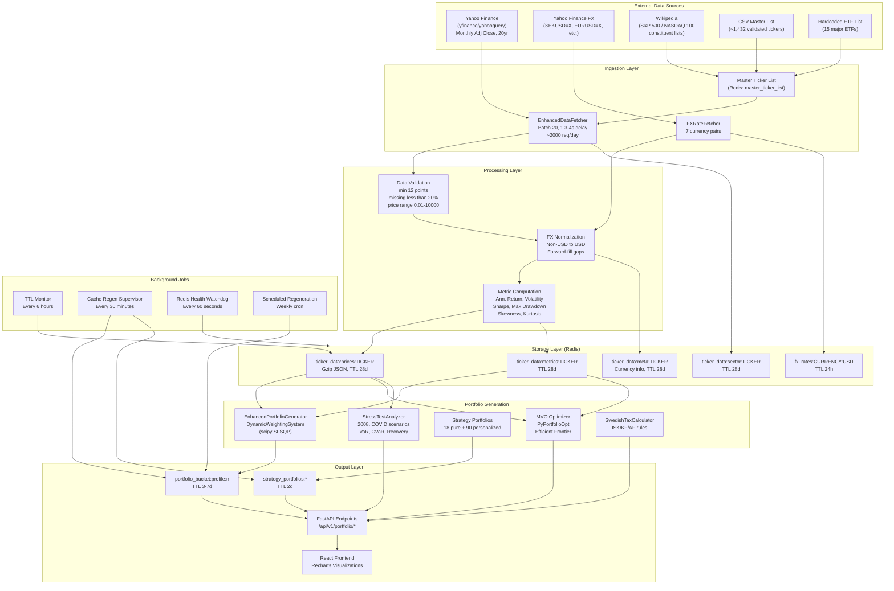

# Data Sources and Methodology

This document is the single source of truth for data provenance, processing pipeline, financial methodology, and assumptions in the Portfolio Navigator Wizard project. It supports transparency, reproducibility, and correct interpretation of results.

---

## Table of Contents

1. [External Data Sources](#1-external-data-sources)
2. [Ticker Universe](#2-ticker-universe)
3. [Data Processing Pipeline](#3-data-processing-pipeline)
4. [Financial Methodology](#4-financial-methodology)
5. [Data Freshness and Update Schedule](#5-data-freshness-and-update-schedule)
6. [Assumptions and Limitations](#6-assumptions-and-limitations)
7. [Data Attribution Policy](#7-data-attribution-policy)
8. [Data Workflow Architecture](#8-data-workflow-architecture)

---

## 1. External Data Sources

### 1.1 Market Price Data

| Attribute | Value |
|-----------|--------|
| **Provider** | Yahoo Finance |
| **Libraries** | yfinance 0.2.66, yahooquery >= 2.4.1 |
| **Base URL** | https://query1.finance.yahoo.com |
| **Data** | Monthly adjusted close prices |
| **History** | Up to 20 years (required for stress tests including 2008 crisis) |
| **Authentication** | None (public, unauthenticated API) |
| **Rate limits** | ~2,000 requests/day; batch size 20; 1.3–4 seconds delay between requests |
| **Code location** | `backend/utils/enhanced_data_fetcher.py` (`_fetch_ticker_yahooquery`, `_fetch_ticker_yahooquery_range`) |

### 1.2 Fundamental and Metadata

| Attribute | Value |
|-----------|--------|
| **Provider** | Yahoo Finance (yahooquery) |
| **Data** | Sector, industry, country, exchange, company name/summary |
| **Code location** | `backend/utils/enhanced_data_fetcher.py` |

### 1.3 Foreign Exchange Rates

| Attribute | Value |
|-----------|--------|
| **Provider** | Yahoo Finance (yahooquery) |
| **Ticker format** | XXXUSD=X (e.g. SEKUSD=X, EURUSD=X) |
| **Supported pairs** | EUR, GBP, SEK, CHF, NOK, DKK, PLN vs USD |
| **Purpose** | Convert non-USD-denominated ticker prices to USD for consistent analysis |
| **Granularity** | Daily; missing dates (weekends/holidays) forward-filled |
| **Code location** | `backend/utils/fx_fetcher.py` |

### 1.4 Ticker Universe Sources

| Source | Description | When used |
|--------|-------------|-----------|
| **Validated master list (CSV)** | `backend/scripts/reports/fetchable_master_list_validated_latest.csv`; ~1,432 validated tickers | Loaded when Redis `master_ticker_list_validated` is empty |
| **Redis master list** | Keys `master_ticker_list`, `master_ticker_list_validated` | Primary; validated list has 1-year TTL |
| **Wikipedia** | S&P 500: List_of_S%26P_500_companies; NASDAQ 100: Nasdaq-100 (tables scraped via pandas `read_html`) | Bootstrap when master list is empty |
| **Hardcoded ETF list** | 15 major ETFs: SPY, IVV, VOO, QQQ, VTI, EFA, IWM, GLD, VEA, DIA, VWO, BND, AGG, VXUS, VTV | Always included in universe; defined in `_fetch_top_etfs()` in `enhanced_data_fetcher.py` |

---

## 2. Ticker Universe

- **Universe size**: ~1,432 validated tickers (S&P 500, NASDAQ 100, 15 major ETFs). Exact count depends on validation run.
- **Validation**: A ticker is “validated” only if it has both prices and sector data successfully fetched and cached. The validated list is published to Redis and CSV after a full fetch run.
- **Feature flag**: `USE_VALIDATED_MASTER_LIST` (default false) restricts the fetcher to the validated list only; when false, the full master list with inference path is used.

---

## 3. Data Processing Pipeline

### 3.1 Ingestion

- **Flow**: Master ticker list (Redis or CSV or Wikipedia bootstrap) → `EnhancedDataFetcher.fetch_ticker_data()`.
- **Request handling**: Single worker (`MAX_WORKERS = 1`), batch size 20, random delay 1.3–4 seconds between batches to respect rate limits.
- **Data fetched**: 20-year monthly adjusted close from Yahoo Finance; sector/metadata from Yahoo.

### 3.2 Validation Rules

Applied in `enhanced_data_fetcher.py` (`_validate_price_data` and `_validate_and_cache_price_data`):

| Rule | Threshold | Action if failed |
|------|-----------|------------------|
| Minimum data points | At least 12 months | Ticker rejected, not cached |
| Missing values | No more than 20% missing | Ticker rejected |
| Price range | All prices between 0.01 and 10,000 | Ticker rejected (suspicious range) |
| All-zero / negative | No all-zero or negative price series | Ticker rejected |
| Non-zero variance | Required for metrics | Implicit in downstream computation |

### 3.3 FX Conversion

- **When**: Non-USD tickers are converted to USD at storage time (in `enhanced_data_fetcher.py`) using `FXRateFetcher`.
- **Method**: Historical daily FX rates from Yahoo; for each date in the price series, the corresponding FX rate is applied. Missing dates (e.g. weekends) are forward-filled from the last available rate.
- **Metadata**: Stored in `ticker_data:meta:{TICKER}`: `native_currency`, `stored_currency`, `converted`.

### 3.4 Metric Computation

- **Location**: `port_analytics.py` (primary for API/UI), `batch_compute_all_metrics.py` / `calculate_portfolio_ticker_metrics.py` for batch backfill.
- **Input**: Monthly adjusted close prices (after validation and FX conversion).
- **Outputs**: Annualized return, risk (volatility), max drawdown, Sharpe ratio, skewness, kurtosis, data quality flag. See [Section 4](#4-financial-methodology) for formulas.
- **Storage**: Computed at fetch time; stored in Redis `ticker_data:metrics:{TICKER}` with same TTL as prices.

### 3.5 Storage

- **Backend**: Redis via `RedisFirstDataService` and `redis_portfolio_manager`.
- **Key patterns**: See `docs/DATA_DICTIONARY.md` and `docs/REDIS_ARCHITECTURE.md`.
- **Ticker data**: Prices stored as gzip-compressed JSON. TTLs use +/- 15% jitter to avoid stampede on expiry.

---

## 4. Financial Methodology

### 4.1 Returns

- **Monthly returns**: `prices.pct_change().dropna()`.
- **Annualized return (compound)** used in `port_analytics.py`:  
  `annual_return = (1 + monthly_return)^12 - 1`  
  where `monthly_return` is the mean of monthly returns.
- **Note**: Batch metrics scripts use simple annualization `mean_return * 12` in some code paths; for user-facing analytics the compound formula in `port_analytics.py` is the reference.

### 4.2 Risk (Volatility)

- **Annualized volatility**: `annual_risk = monthly_std * sqrt(12)`.

### 4.3 Maximum Drawdown

- **Computation**:  
  - Cumulative growth: `cumulative = (1 + returns).cumprod()`  
  - Running maximum: `rolling_max = cumulative.expanding().max()`  
  - Drawdowns: `drawdowns = (cumulative - rolling_max) / rolling_max`  
  - **Max drawdown**: `drawdowns.min()`.

### 4.4 Sharpe Ratio

- **Formula**: `(portfolio_return - risk_free_rate) / portfolio_risk`  
- **Risk-free rate**: 0.038 (3.8%) in `port_analytics.py`; other modules may use 0. Documented here for transparency; see also [Section 6](#6-assumptions-and-limitations).

### 4.5 Correlation and Two-Asset Risk

- **Correlation**: Pearson correlation of aligned monthly returns.
- **Two-asset portfolio risk**:  
  `portfolio_risk = sqrt(w1^2*σ1^2 + w2^2*σ2^2 + 2*w1*w2*σ1*σ2*ρ)`.

### 4.6 Diversification Score

- Multiple implementations exist in the codebase: correlation-based (`_calculate_portfolio_diversification_score`: max(0, 100 - avg_correlation*100)), sector/allocation-based (`_calculate_sophisticated_diversification_score`), simple count-based (`_calculate_simple_diversification_score`), and the portfolio router variant combining correlation and concentration: `(1 - avg_correlation) * (1 - concentration) * len(stocks) / 10`.  
- The portfolio router and strategy optimizer use `port_analytics` variants (sophisticated or correlation-based). See `port_analytics.py` and `routers/portfolio.py` for the exact variant per endpoint.

### 4.7 Data Quality Flag

- **Definition**: `data_quality = 'good'` if at least 180 months of returns (~15 years); otherwise `'limited'`.

### 4.8 Portfolio Optimization

- **MVO (Mean-Variance Optimization)**: PyPortfolioOpt (`EfficientFrontier`); objectives include max Sharpe, min variance, target return/risk.
- **Dynamic weighting**: scipy SLSQP in `EnhancedPortfolioGenerator` for risk-profile-based portfolio generation.
- **Min overlap**: Default 12 months of overlapping returns for optimization; configurable in code.

### 4.9 Stress Testing

- **Scenarios**: Historical windows (e.g. COVID-19 Feb–Apr 2020; 2008 crisis Sep 2008–Mar 2010).
- **Metrics**: Peak, trough, recovery (e.g. first month reaching ≥95% of pre-crisis peak), volatility over the period.
- **Portfolio value**: Sum of (price[ticker] * weight[ticker]) over aligned dates; series normalized to 100 at scenario start.

### 4.10 Tax and Transaction Costs

- **Tax**: Swedish rules (ISK, KF, AF) with parameters as documented in `swedish_tax_calculator.py` (year-specific).
- **Transaction costs**: Avanza courtage tiers and rebalancing frequency (e.g. quarterly) as in `avanza_courtage_calculator.py`.

---

## 5. Data Freshness and Update Schedule

| Data | TTL | Refresh mechanism |
|------|-----|--------------------|
| Ticker prices, sector, metrics, meta | 28 days (±15% jitter) | On cache miss; background TTL monitor and refresh scripts |
| FX rates | 24 hours | On access; cached in Redis |
| Master ticker list | 24 hours (full); 1 year (validated) | Reload from Redis/CSV/Wikipedia as above |
| Portfolio buckets | 7 days | Background regen (e.g. every 30 min check); `scheduled_regen.py` (weekly) |
| Strategy portfolios | 2 days (documented in plan); 7 days in code | Pre-generation at startup; background regen |
| Eligible tickers (optimization) | 7 days | Invalidated on new ticker cache; background regen |
| portfolio:top_pick, portfolio:stats | 7 / 14 days | Set by `scheduled_regen.py` |

- **Background tasks** (in `main.py`): TTL monitoring every 6 hours; cache regeneration supervisor every 30 minutes; Redis health watchdog every 60 seconds.
- **Yahoo Finance unavailability**: No automatic fallback provider; cached data in Redis remains available until TTL expiry. Staleness and availability are limited by cache TTL and regeneration.

---

## 6. Assumptions and Limitations

- **Risk-free rate**: Standardized at 3.8% (0.038) across port_analytics, MVO optimizer, portfolio router, and strategy optimizer for Sharpe ratio calculations.
- **Annualization**: Compound annual return `(1 + monthly_return)^12 - 1` is used consistently in port_analytics, enhanced_data_fetcher, batch metrics scripts, and portfolio_stock_selector. Historical performance does not predict future results.
- **FX**: Conversion uses historical spot-style rates from Yahoo, not transaction rates; suitable for analysis, not execution.
- **Data quality**: Yahoo Finance data may contain gaps or inaccuracies; validation rules (Section 3.2) reduce but do not eliminate bad data.
- **Rate limits**: Yahoo Finance is subject to rate limits and may throttle or fail; the system is designed to minimize calls via Redis-first caching.

---

## 7. Data Attribution Policy

- **Primary source**: Yahoo Finance (market data and FX).
- **UI**: Data source should be credited wherever portfolio recommendations, optimization results, stress tests, projections, or exports are shown (e.g. “Data source: Yahoo Finance” or “Source: Yahoo Finance (monthly returns, annualized). Historical data for educational purposes only.”).
- **Full methodology**: This document and `docs/DATA_DICTIONARY.md` are the reference for detailed attribution and methodology.

---

## 8. Data Workflow Architecture

---

For Redis key-level detail, see [DATA_DICTIONARY.md](DATA_DICTIONARY.md). For Redis architecture and workflows, see [REDIS_ARCHITECTURE.md](REDIS_ARCHITECTURE.md).
